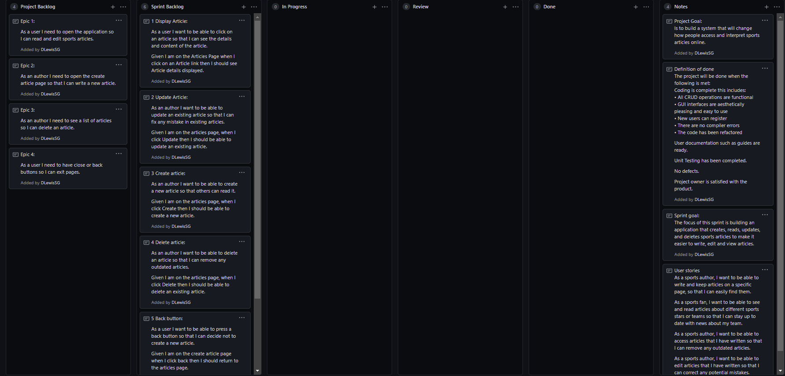
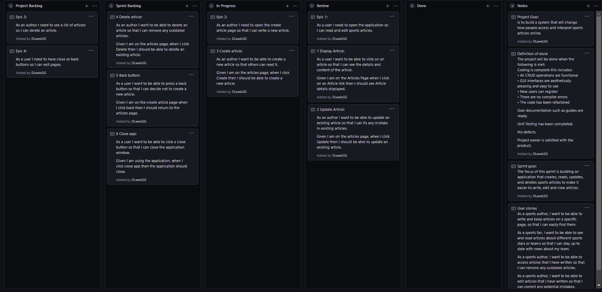
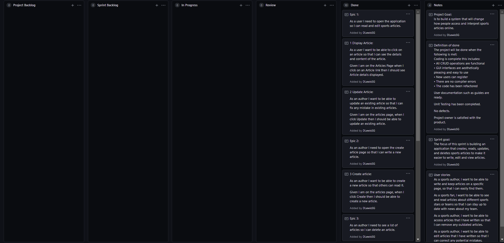

# Documentaion
Sports Articles Application created using C#, SQL, XAML, and Entity Framework.

## Project Goal
Is to build a system that will change how people access and interpret sports articles online.

## Definition of Done
The project will be done when the following is met:

* Coding is complete this includes:

>*	All CRUD operations are functional
>*	GUI interfaces are aesthetically pleasing and easy to use
>*	New users can register
>*	There are no compiler errors
>*	The code has been refactored

* User documentation such as guides are ready.

* Unit Testing has been completed.

* No defects.

* Project owner is satisfied with the product.

## Sprint Goal
The focus of this sprint is building an application that creates, reads, updates, and deletes sports articles to make it easier to write, edit and view articles.

## User Guide
Create Instructions

1) Click the "Create" button. This will open the create new article page.
2) Fill in Id, Title, and content boxes and select an author from the drop down list.
3) Click "Create" button to add the new article or select "Back" to cancel and return to the main window.

Update Instructions

1) Select the article that you wish to update from the list.
2) Change the desired fields in the text box.
3) Press update to confirm the change, otherwise click on any other article or close the window.

Delete Instructions

1) Select the article you wish to to delete.
2) Click the delete button to permanently delete the article.

Close Application Instructions

To close the application you can either press the close button on the main window, or press the cross on the top right of the window.

## Sprint Review

During this sprint I:

* Created the classes and the Database context class
* Used entity framework to create a database from the models created.
* Populated the database
* Created the CRUD functionality
* Wrote Unit tests for the CRUD functions
* Created the GUI in WPF files
* Fixed defects with the articles list and Update function

Below is the Kanban board at the beginning of the project:

Below is the Kanban project during the implementation of the project:

Below is the Kanban project at the end of the implementation:

## Sprint Retrospective

One reason for the success of this sprint was breaking the overall project down into smaller tasks. One lesson carried over 
from the previous sprint was that without breaking the project down into smaller tasks can improve productivity as code is written incrementally
decreasing the risk of confusion and making each increment more managable. 

Another action that made this sprint a success was committing work to a remote repo regularly. After each task was completed I committed 
my work to Github, this meant I could make changes to my project without fear of ruining my previous work. Being bolder when writting my
code increased my productivity and saved me time as I knew if something didn't work I could retrieve the code from my previous commit.

## Project Retrospective

Overall, I have learned a lot from this project. I overcame some obstacles particularly when I had issues 
displaying only the article title in the listbox as well as an issue I faced linking the article and author tables. 
I learned that breaking a project down into smaller tasks before implementing can keep me in control of the project 
as I had to restart due to messy code and no clear direction.

Future scope of the applications

If the chance arose to further develop the application the following functions would be added:
* Create a log in page that would also allow a user to register a new author
* Save articles to a text file
* Add images to articles